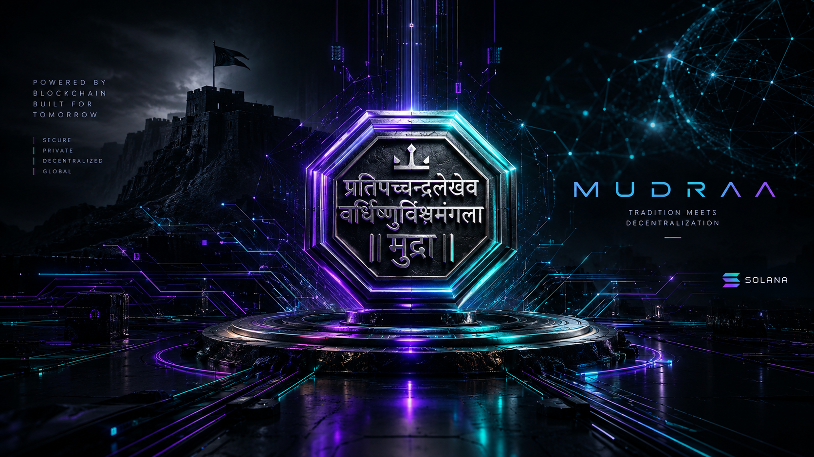

# MudrAA
### Powered by the Rajmudra Verification Engine

**Institutional-grade sovereign trade liquidity on Solana.**  
*Delivering deterministic settlement finality, bilateral freight provenance, and shielded enterprise credit.*

 

 

---

## ⚔️ The Vision & Sovereign Heritage

Global cross-border trade finance is a **$3.5 Trillion** economic engine that remains constrained by legacy verification rails, slow settlement velocity, and systemic collateral friction. Exporters face 60-to-90-day liquidity constraints, while institutional credit allocators struggle with counterparty verification, opaque fulfillment tracking, and unhedged balance sheet risks.

Existing Web3 RWA protocols attempted to bridge real-world trade assets on-chain—but forced enterprises into a fatal dilemma: **sacrifice commercial pricing, volumes, and counterparty relationships on a public ledger, or rely on an opaque, centralized intermediary.**

**MudrAA** bridges this divide.

Originating from Maharashtra, the protocol derives its administrative governance and defensive architecture from the **Ashta Pradhan** (the Council of Eight Ministers) instituted by **Chhatrapati Shivaji Maharaj**. At its core lies the **Rajmudra Verification Engine**—a modern cryptographic realization of the historic royal seal that guaranteed authentic state records, tamper-proof execution, and public trust for sovereign welfare.

---

## 🏛️ The Ashta Pradhan Architecture

MudrAA coordinates its execution, security, and capital lifecycle across eight specialized institutional pillars:

* **The Executive Dispatcher** *(Insp. by Peshawa)*: High-throughput Anchor instruction orchestration and lifecycle state management.
* **The Treasury & Risk Vaults** *(Insp. by Amatya)*: Multi-tranche liquidity architecture, dynamic capital preservation buffers, and cross-currency stabilization.
* **The Sovereign Commitment Seal** *(Insp. by Sachiv)*: The Rajmudra engine—executing zero-knowledge mathematical verification directly on Solana L1.
* **The External Trade Gateway** *(Insp. by Sumant)*: Ingesting standardized enterprise data schemas, multimodal carrier telemetry, and sovereign compliance oracles.
* **The Anti-Fraud Citadel** *(Insp. by Senapati)*: Consensus-level deterministic state uniqueness, ensuring uncompromised collateral integrity.
* **The Legal Recourse Engine** *(Insp. by Nyayadhish)*: Cross-border digital negotiable instrument perfection and unappealable defense covenants.
* **The Compliance Guardian** *(Insp. by Panditrao)*: Scoped zero-knowledge viewing credentials enabling voluntary regulatory auditability without open-ledger surveillance.
* **The Shielded Intelligence Layer** *(Insp. by Waknavis)*: Cryptographically confidential capital dispersal safeguarding enterprise trade secrets and cash flows.

---

## 📜 Development Status
The complete codebase, reproduction test suites, and deployment runbooks
will be made public here at the conclusion of the judging entry period.